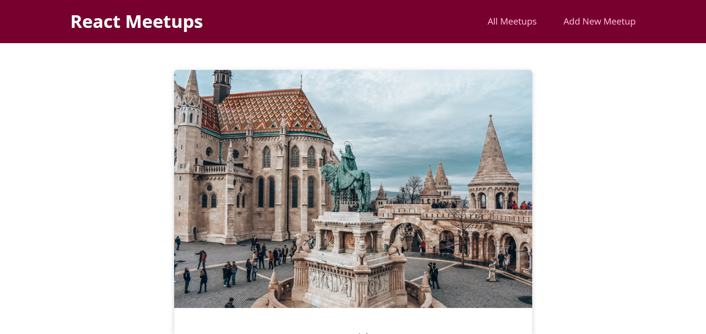
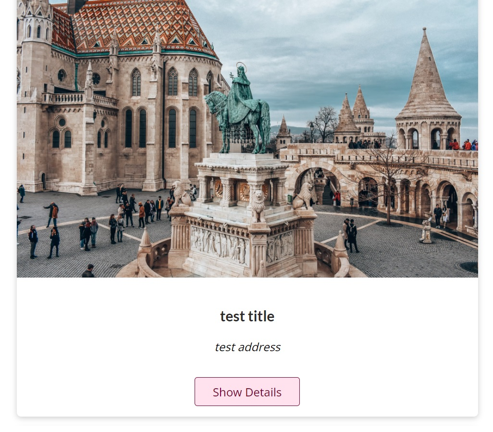

# Meetup-App

view the best places to hangout, post your own meetup place

## Installation

Install my-project with npm

```bash
  cd Meetup-App
  npm install package.json
```
    
## Environment Variables

To run this project, you will need to add the following environment variables to your .env.local file

`DB_URL`

your database url


## Screenshots





